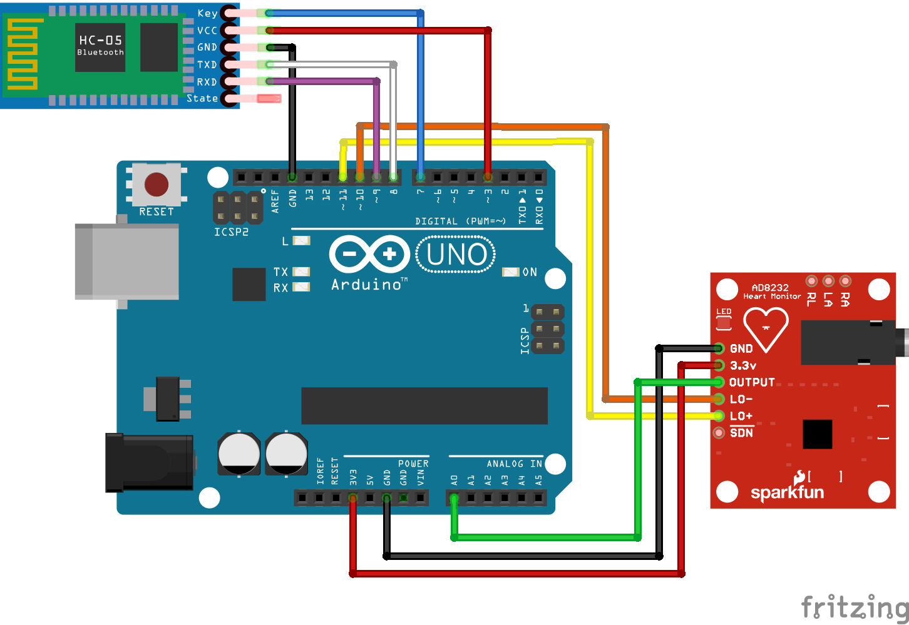
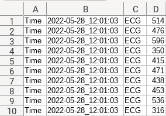
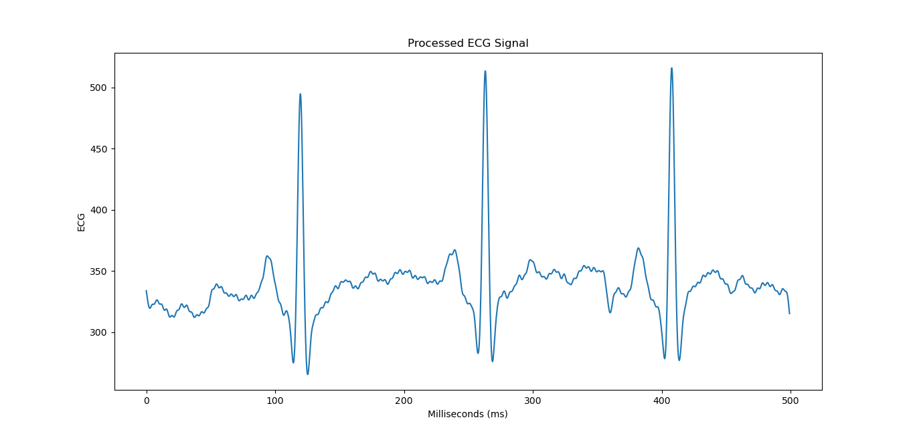

# SportsWatch-Arduino
Arduino code for the Connected Sports Watch app.

## Wiring

	

## Data Processing
This project contains contains two python scripts :
* readuino : Reads ECG values from the arduino's serial connection and saves them in a csv file.

	

* chart : Processes and charts the ECG values stored in a csv file.

	

